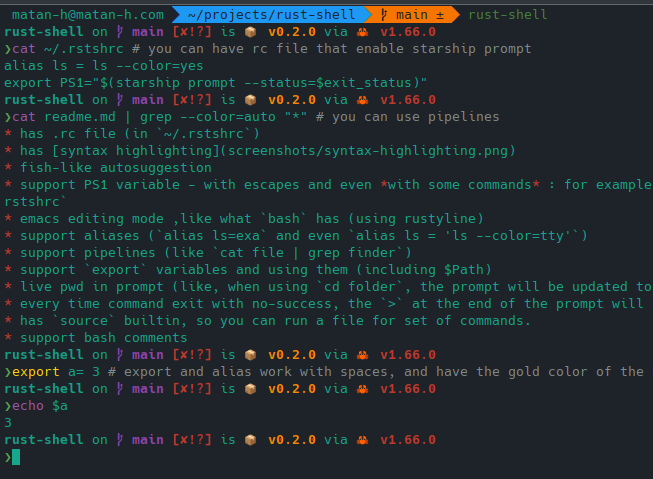

# rust-shell
a unix shell written in rust

## Features

### Main features
* has .rc file (in `~/.rstshrc`)
* has [syntax highlighting](screenshots/syntax-highlighting.png)
* fish-like autosuggestion
* emacs editing mode ,like what `bash` has (using rustyline)

### Supported built-ins
* has `source` builtin, so you can run a file for set of commands.
* support `export` and `alias` - even with spaces (`alias ls = ls --color=auto` or `export PATH =$PATH:$HOME/.cargo/bin/`), see more examples in the [examples](examples) folder

### Supported syntaxes
* support pipelines (with _space_ on both sides) (like `cat file | grep finder`)
* support bash comments

### Prompt
* support PS1 variable - with escapes and even *with some commands* : for example, you can use the [starship](starship.rs) prompt with `export PS1="$(starship prompt --status=$exit_status)"` - to make that the default, write it to `~/.rstshrc`
* every time command exit with no-success, the `>` at the end of the prompt will be red in the default prompt, instead of green (the color present in the `$PS1` as `$red_or_green`, and the last exit status present as `$exit_status`)
* live pwd in prompt (like, when using `cd folder`, the prompt will be updated to `~/folder`).

# install
download the executable from [github-releases](https://github.com/matan-h/rust-shell/releases/tag/0.2.0) (created by the github action automatically ), then run it through the command line, (for linux, you need to `chmod +x` it first)

# Contribute:
1. install `rustup` and `cargo`
2. Clone this repo (`git clone https://github.com/matan-h/rust-shell.git`)
3. run it with `cargo run`