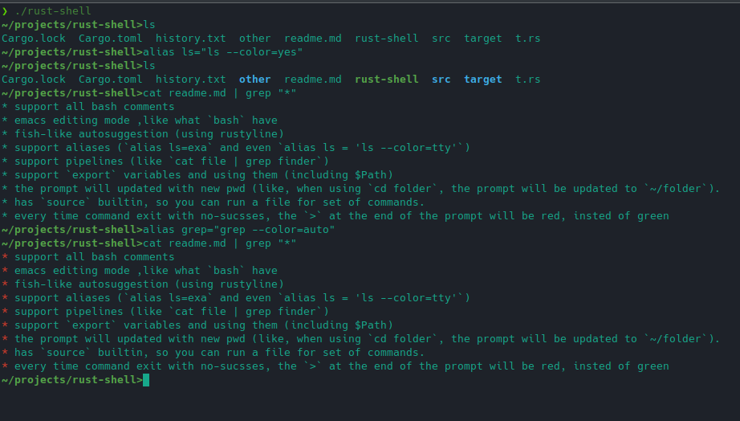

# rust-shell
a unix shell written in rust

## Features
* support all bash comments
* emacs editing mode ,like what `bash` have
* fish-like autosuggestion (using rustyline)
* support aliases (`alias ls=exa` and even `alias ls = 'ls --color=tty'`)
* support pipelines (like `cat file | grep finder`)
* support `export` variables and using them (including $Path)
* the prompt will updated with new pwd (like, when using `cd folder`, the prompt will be updated to `~/folder`).
* has `source` builtin, so you can run a file for set of commands.
* every time command exit with no-sucsses, the `>` at the end of the prompt will be red, insted of green

# setup:
1. install `rustup` and `cargo`
2. Clone this repo (`git clone https://github.com/matan-h/rust-shell.git`)
3. run it with `cargo run`