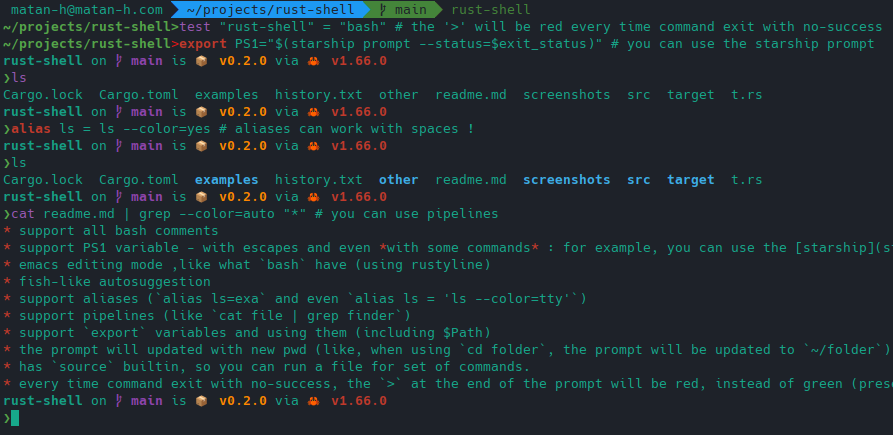

# rust-shell
a unix shell written in rust

## Features
* support all bash comments
* support PS1 variable - with escapes and even *with some commands* : for example, you can use the [starship](starship.rs/) prompt with `export PS1="$(starship prompt --status=$exit_status)"`
* emacs editing mode ,like what `bash` have (using rustyline)
* fish-like autosuggestion
* support aliases (`alias ls=exa` and even `alias ls = 'ls --color=tty'`)
* support pipelines (like `cat file | grep finder`)
* support `export` variables and using them (including $Path)
* the prompt will updated with new pwd (like, when using `cd folder`, the prompt will be updated to `~/folder`).
* has `source` builtin, so you can run a file for set of commands.
* every time command exit with no-success, the `>` at the end of the prompt will be red, instead of green (present in the `$PS1` as `$red_or_green` environment variable)
# install
download the executable from [github-releases](https://github.com/matan-h/rust-shell/releases/tag/0.2.0) (created by the github action automatically ), then run it through the command line, (for linux, you need to `chmod +x` it first)
# setup:
1. install `rustup` and `cargo`
2. Clone this repo (`git clone https://github.com/matan-h/rust-shell.git`)
3. run it with `cargo run`